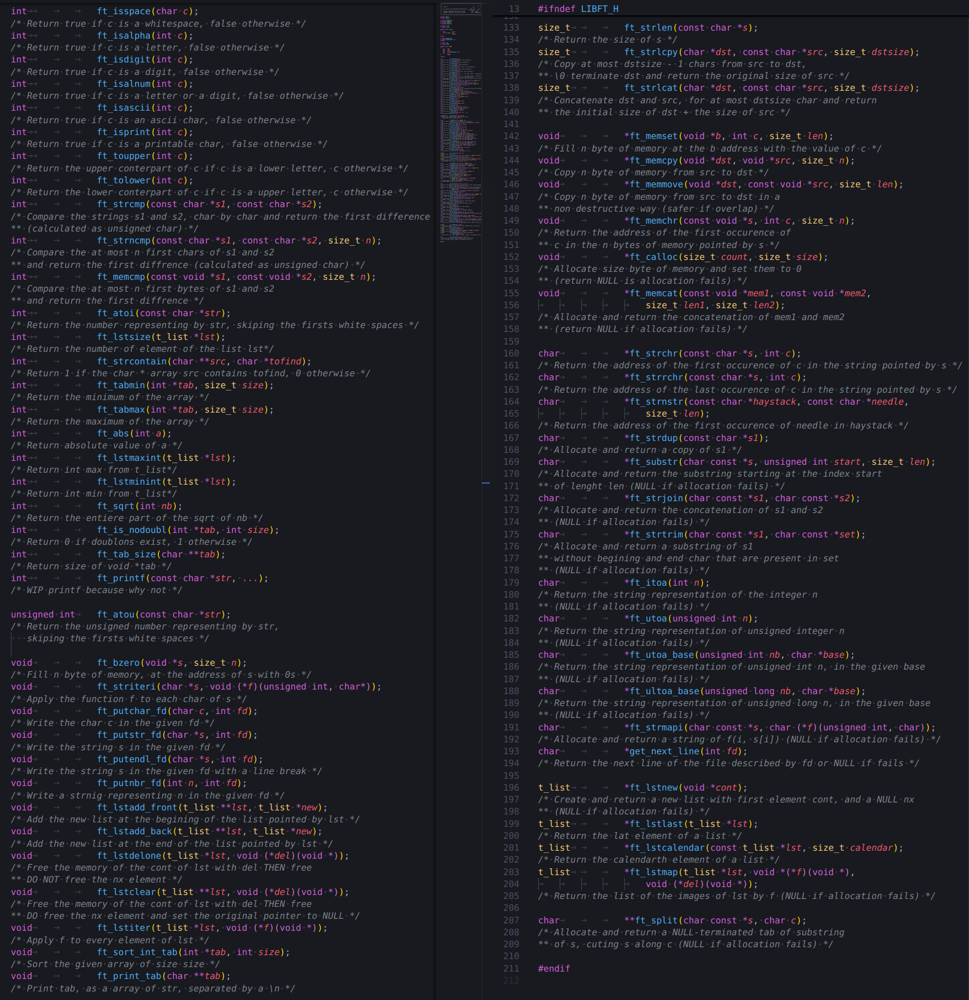

<div id="top"></div>

<div align="center">
	<a href="https://github.com/Link-Wolf/libft" title="Go to GitHub repo"></a>
	<a href="https://"></a>
	<a href="https://"></a>
	<a href="https://github.com/Link-Wolf/libft/stargazers"></a>
	<a href="https://github.com/Link-Wolf/libft/network/members"></a>
	<a href="https://github.com/Link-Wolf/libft/issues"></a>
	<a href="https://www.apple.com/macos/" title="Go to Apple homepage"></a>
</div>

<!-- PROJECT LOGO -->
<br />
<div align="center">
  <a>
    
  </a>

  <h3 align="center">libft</h3>

  <p align="center">
	  <em>Your own library</em><br/>
    A C project to create our first library of reimplemented functions and more
    <br />
    <br />
    <a href="https://github.com/Link-Wolf/libft/issues">Report Bug</a>
    ·
    <a href="https://github.com/Link-Wolf/libft/issues">Request Feature</a>
  </p>
</div>

<!-- TABLE OF CONTENTS -->
<details>
  <summary>Table of Contents</summary>
  <ol>
    <li>
      <a href="#about-the-project">About The Project</a>
    </li>
    <li>
      <a href="#getting-started">Getting Started</a>
      <ul>
        <li><a href="#prerequisites">Prerequisites</a></li>
        <li><a href="#installation">Installation</a></li>
      </ul>
    </li>
    <li><a href="#usage">Usage</a></li>
    <li><a href="#roadmap">Roadmap</a></li>
    <li><a href="#contributing">Contributing</a></li>
  </ol>
</details>

<!-- ABOUT THE PROJECT -->

## About The Project

<div align="center">
  <a>
    
  </a>
</div>

This project is focused on create our first C library <br />
It has to be filled with some recoded native functions, but we also added a lot of functions we created during our 42-cursus to still use it by the time <br />
It is also why it contains the whole [ft_printf](https://github.com/Link-Wolf/ft_printf) project or the [get_next_line](https://github.com/Link-Wolf/get_next_line) one for example !

### Reimplemented natives functions

-   isalpha / isdigit / isalnum / isascii / isprint / strlen / memset / bzero / memcpy / memmove / strlcpy / strlcat / toupper / tolower / strchr / strrchr / strncmp / memchr / memcmp / strnstr / atoi / calloc / strdup

### Reinterpreted or new functions

-   ft_printf / ft_substr / ft_strjoin / ft_strtrim / ft_split / ft_itoa / ft_strmapi / ft_striteri / ft_putchar_fd / ft_putstr_fd / ft_putendl_fd / ft_putnbr_fd / get_next_line

### New lists functions

-   ft_lstnew / ft_lstadd_front / ft_lstsize / ft_lstlast / ft_lstadd_back / ft_lstdelone / ft_lstclear / ft_lstiter / ft_lstmap

### Additionnals functions added by the time

-   ft_utoa / ft_ultoa_base / ft_utoa_base / ft_strcontain / ft_strcmp / ft_tab_min / ft_tab_max / ft_abs / ft_lstcalendar / ft_memcat / ft_sort_int_tab / ft_lstmaxint / ft_lstminint / ft_sqrt / ft_is_nodoubl / ft_tab_size / ft_print_tab / ft_atou

For all informations about functions behaviour and parameters, check their documentation [here](/libft.h)

<p align="right">(<a href="#top">back to top</a>)</p>

<!-- GETTING STARTED -->

## Getting Started

Because it's a simple C library, there isn't much to say here

### Prerequisites

Having a C compiler like cc, gcc or clang

### Installation

1. Clone the repo
    ```sh
    git clone https://github.com/Link-Wolf/libft.git
    ```
2. Compile the project
    ```sh
    cd libft; make
    ```
3. Include the libft in your C project
    ```c
    #include "libft/libft.h
    ```
4. Compile your project with the libft library
    ```sh
    gcc your_project.c -L./libft -lft
    ```

<p align="right">(<a href="#top">back to top</a>)</p>

<!-- USAGE EXAMPLES -->

## Usage

Use all the libft functions as you'd use the equivalents natives ones, or read the [documentation](/libft.h) to understand what do and how work the others !

```c
char *example = "_-aw,i| \t	WO42s!";

for (int i = 0; i < ft_strlen(example); i++) {
	if (!ft_isprint(example[i]) || !ft_isalpha(example[i]))
		ft_printf("0");
	else
		ft_printf("1");
}
```

Output

```c
0011010000110010
```

<p align="right">(<a href="#top">back to top</a>)</p>

<!-- ROADMAP -->

## Roadmap

-   [x] Add [ft_printf](https://github.com/Link-Wolf/ft_printf)
-   [x] Add [get_next_line](https://github.com/Link-Wolf/get_next_line)

See the [open issues](https://github.com/Link-Wolf/libft/issues) for a full list of proposed features (and known issues).

<p align="right">(<a href="#top">back to top</a>)</p>

<!-- CONTRIBUTING -->

## Contributing

If you have a suggestion that would make this better, please fork the repo and create a pull request. You can also simply open an issue with the tag "enhancement".
Don't forget to give the project a star! Thanks again!

1. Fork the Project
2. Create your Feature Branch (`git checkout -b feature/AmazingFeature`)
3. Commit your Changes (`git commit -m 'Add some AmazingFeature'`)
4. Push to the Branch (`git push origin feature/AmazingFeature`)
5. Open a Pull Request

<p align="right">(<a href="#top">back to top</a>)</p>
